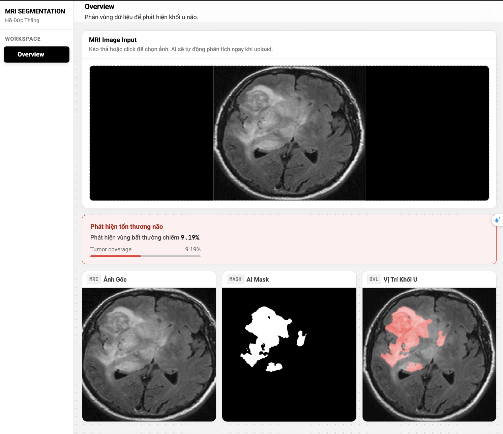
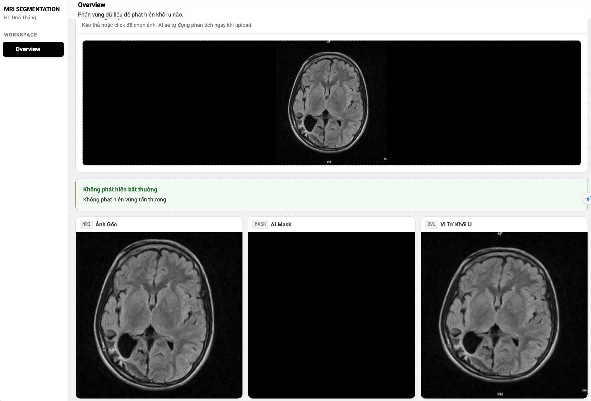

# MRI Segmentation

This project is a Brain Tumor MRI Segmentation application using a U-Net model. It consists of a FastAPI backend to serve the machine learning model and a frontend built with modern web technologies (Vite/React).

## Project Structure

- `BE/`: Backend directory containing the FastAPI application (`main.py`) and Python dependencies (`requirements.txt`).
- `FE/`: Frontend directory containing the UI source code.
- `brain_tumor_unet.keras`: The pre-trained U-Net machine learning model for MRI segmentation.
- `package.json`: Root package file that contains scripts to easily manage both the frontend and backend concurrently.

## Prerequisites

- **Node.js** and **npm**
- **Python 3**
- (Optional but recommended) A virtual environment for Python

## Getting Started

### 1. Setup

The project includes a root script to install dependencies for both the frontend and the backend automatically.

```bash
npm run setup
```
This will:
1. Install root dependencies (like `concurrently`).
2. Navigate into `FE/` and install frontend dependencies.
3. Navigate into `BE/` and install Python requirements using `pip`.

### 2. Running the Application

You can start both the frontend and backend development servers concurrently using a single command from the root directory:

```bash
npm run dev
```

Alternatively, you can run them separately:
- **Frontend only:** `npm run dev:fe`
- **Backend only:** `npm run dev:be`

## Model

The application uses the `brain_tumor_unet.keras` model to perform segmentation tasks on brain MRI scans to locate and segment tumor regions.

## Results

### Prediction with Lesion (Dự đoán có tổn thương)


### Prediction without Lesion (Dự đoán không có tổn thương)

